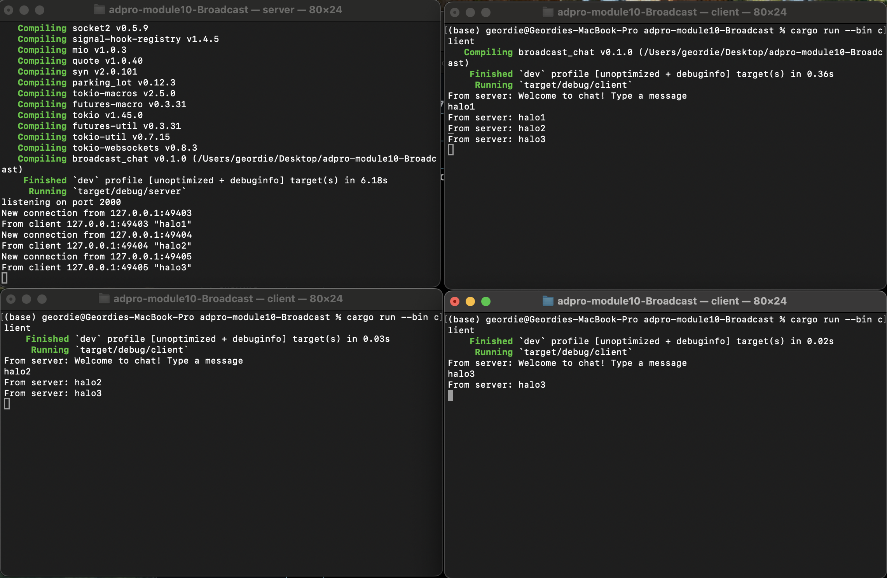

## understanding How It Works

In this experiment, I explored a broadcast chat application using asynchronous programming and WebSockets in Rust. I started a single server process to listen for incoming connections and launched three clients from different terminals. When any client sent “hello1,” “hello2,” or “hello3,” the server received it and immediately broadcasted it to all connected clients. Each client then printed every message sent by the others, demonstrating real-time delivery. Under the hood, asynchronous tasks let the server handle multiple connections concurrently without blocking. This pattern shows how async programming excels for real-time applications like chat, where responsiveness and concurrency are essential.

## 2.2 Modifying the port

In this test, I reconfigured the WebSocket port from 2000 to 8080 on both the server and client. On the server side, I updated the bind address to 127.0.0.1:8080, and on the client side I changed the connection URI to ws://127.0.0.1:8080. After launching the server and multiple clients, every connection succeeded (as you can see in the screenshot), and each client was able to both send and receive the broadcast messages without any errors.

This experiment confirms that the WebSocket protocol itself doesn’t change—the ws:// prefix remains the same—and that you only need to ensure both server and clients are using the same port. As long as the server listens on the correct port and the clients target that same port, the application will communicate over WebSockets flawlessly.

